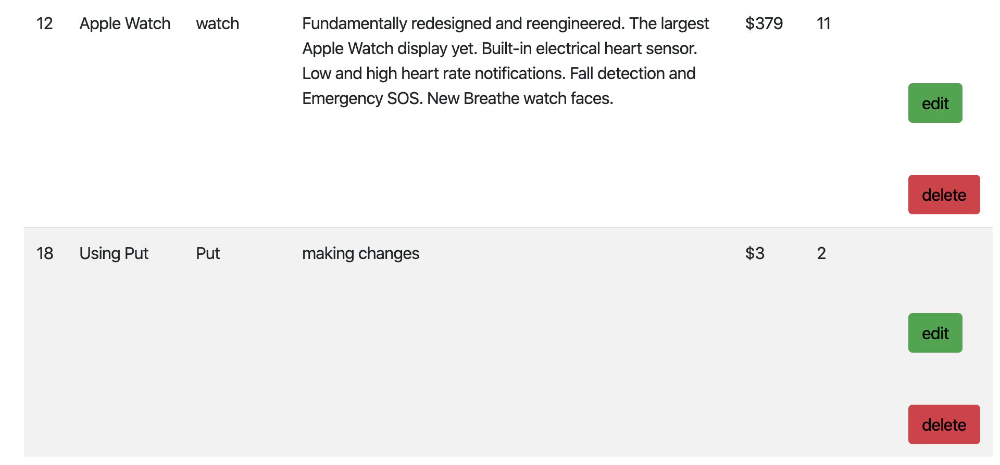

# C# Admin server with .NET Core

This application has a .NET C# REST API backend that fetches data from a MySQL DB that interacts with a React Application that allows you create new entries, read, delete, and update to the MySQL DB.


## Demo
Below is a demo of the page utilizing CRUD methods.


### Read


### Create


### Update


### DELETE
)


## Images

## Read
This demonstrates that my front end react application was able to fetch data from my .NET backend


## Create
I first created a new product


The product that I created was added to the list of all products


## Update
Updating previews product Using Post Method with Using Put


## Delete
After updating but before deleting the product

Deleting the item made with the id 18 by pressing de delete button. After deleting the item have been remove.


## Intalling 
* Clone this repo and 
* Then in the C# files change the connection string in the startup file to the  database that it will be connect.
* Then run the application using : 
```
dotnet run
```
* The backend and the frontend will establish a connection with each other.
* If running into any problems go to the build with resources showing below

### Built With 

* [React](https://reactjs.org/docs/getting-started.html) - JavaScript library for building user interfaces
* [C#](https://docs.microsoft.com/en-us/dotnet/csharp/) - An elegant and type-safe object-oriented language that enables developers to build a variety of secure and robust applications that run on the .NET Framework.
* [MySQL](https://dev.mysql.com/doc/) - Relational database management system


## Author
* [Christiam Hernandez](https://github.com/christiamenrique)

## License

This project is licensed under the MIT License - see the [LICENSE.md](LICENSE.md) file for details


 
